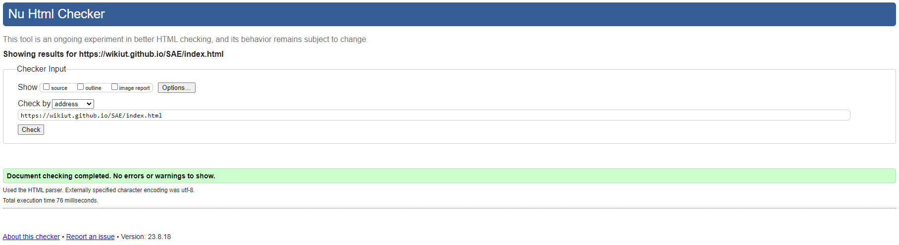
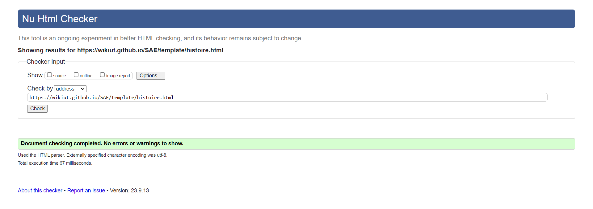
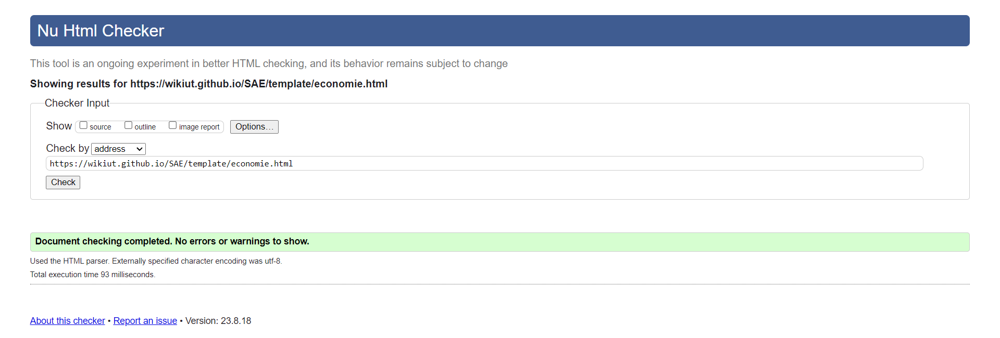
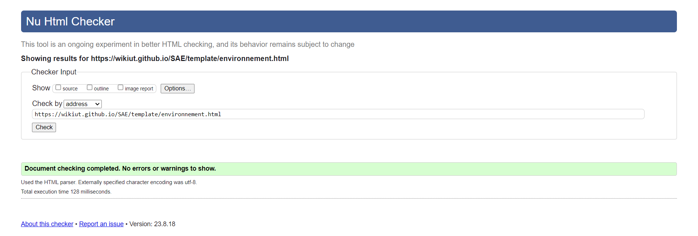
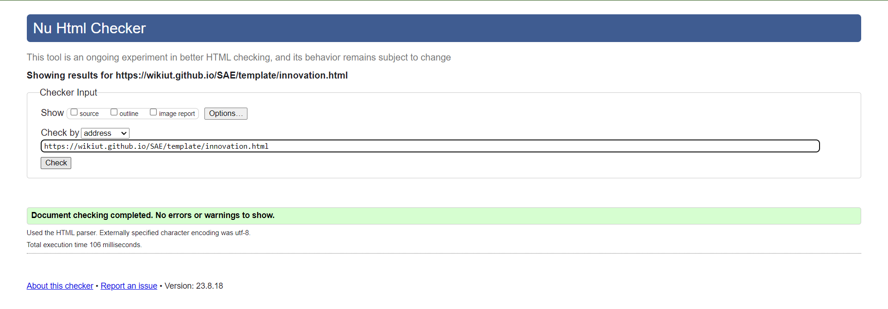

# Site Vitrine Ubisoft  

## URL du site   

GitLab : [Site d'information sur l'entreprise Ubisoft - GitLab](https://sae-wikiut-3e5bc7960b9883920504a22892effeddd24963affb44c76222ac.gitlab.io/)
 
BitBucket : [Site d'information sur l'entreprise Ubisoft - BitBucket](https://wikiut.bitbucket.io/)

## Liens d'accès aux différents URL du projet

GitHub : [Projet - GitHub](https://github.com/WikIUT/SAE)
 
GitLab : [Projet - GitLab](https://gitlab.com/WikIUT/SAE)
 
BitBucket : [Projet - BitBucket](https://bitbucket.org/wikiut/wikiut.bitbucket.io/)

## Membres du groupe 4 :
Etudiant 1 (référent) : [Adam Khnagui](mailto:adam.khnagui@edu.univ-fcomte.fr?subject=SAE_1_05_06)
 
Etudiant 2 : [Alex Immer](mailto:alex.immer@edu.univ-fcomte.fr?subject=SAE_1_05_06)
 
Etudiant 3 : [Corentin Brendle](mailto:corentin.brendle@edu.univ-fcomte.fr?subject=SAE_1_05_06)
 
Etudiant 4 : [Quentin Chambon](mailto:quentin.chambon@edu.univ-fcomte.fr?subject=SAE_1_05_06)
 
Etudiant 5 : [Floryan Bornet](mailto:floryan.bornet@edu.univ-fcomte.fr?subject=SAE_1_05_06)  

## Présentation du projet
  Le but de notre projet est de créer un site d'information sur l'entreprise française Ubisoft.
A travers des recherches, nous détaillerons de manière pertinente chaque catégorie. 
Les catégories sont composées de l'histoire d'Ubisoft, de son économie, de son impact environnemental et des innovations importantes.

## Choix de conception  

Pour la conception du site, nous nous sommes grandement inspirés du site officiel d'[Ubisoft ](https://www.ubisoft.com/fr-fr/) et du site d'un de ses principaux concurrents [Activision Blizzard](https://www.activisionblizzard.com/). Nous avons pris comme référence la charte d'Activision Blizzard pour les listes avec une image à côté d'un texte (disponible [ici](https://careers.activisionblizzard.com/)) et pour le système de 'carousel' nous nous sommes inspirés du site d'Ubisoft notamment de la page d'accueil (disponible [ici](https://www.ubisoft.com/fr-fr/)).    

## Développement Site Web et Validation des pages

### Page d'accueil

**Auteur : IMMER Alex**  

Vérification W3C : [Détail ICI](https://validator.w3.org/nu/?doc=https%3A%2F%2Fwikiut.github.io%2FSAE%2Findex.html)

### Page Histoire

**Auteur : KHNAGUI Adam**  

Verification W3C : [Détail ICI](https://validator.w3.org/nu/?doc=https%3A%2F%2Fwikiut.github.io%2FSAE%2Ftemplate%2Fhistoire.html)

### Page Economie

**Auteur : CHAMBON Quentin**  

Verification W3C : [Détail ICI](https://validator.w3.org/nu/?doc=https%3A%2F%2Fwikiut.github.io%2FSAE%2Ftemplate%2Feconomie.html)

### Page Environnement

**Auteur : BRENDLE Corentin**  

Verification W3C : [Détail ICI](https://validator.w3.org/nu/?doc=https%3A%2F%2Fwikiut.github.io%2FSAE%2Ftemplate%2Fenvironnement.html)

### Page Innovations

**Auteur : BORNET Floryan**  

Verification W3C : [Détail ICI](https://validator.w3.org/nu/?doc=https%3A%2F%2Fwikiut.github.io%2FSAE%2Ftemplate%2Finnovation.html)

## Répartition du travail

### Création et réalisation du ReadMe
- IMMER Alex
- BORNET Floryan

### Questionnaire
#### Questionnaire n°1
- BRENDLE Corentin
- IMMER Alex
- BORNET Floryan

#### Questionnaire n°2
- BRENDLE Corentin
- IMMER Alex
- KHNAGUI Adam
- CHAMBON Quentin
- BORNET Floryan

### Planification - Diagramme de GANTT
#### Planning prévisionnel :

- KHNAGUI Adam
- CHAMBON Quentin

### Recherches d'informations

- BRENDLE Corentin
- IMMER Alex
- KHNAGUI Adam
- CHAMBON Quentin
- BORNET Floryan

### Rapport économique

- BRENDLE Corentin
- IMMER Alex
- KHNAGUI Adam
- CHAMBON Quentin
- BORNET Floryan

### Zoning et Wireframe
- BRENDLE Corentin
- BORNET Floryan

### Développement site

- IMMER Alex
  - Page d’Accueil et de Présentation
- KHANGUI Adam
  - Page Histoire
- CHAMBON Quentin
  - Page Economie
- BRENDLE Corentin
  - Page Environnement
- BORNET Floryan
  - Page Innovations
